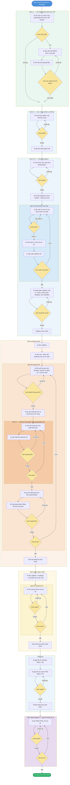

```mermaid
flowchart TD
    U1([User: mục tiêu khoá học + metadata])
    U1 --> A0

    subgraph B_1["Bước 1 — Thu thập tài liệu kiến thức nền"]
        A0[AI hỏi: bạn có muốn cung cấp file/link kiến thức nền không?]
        A0 --> C0{User cung cấp?}
        C0 -- Bỏ qua --> A1_start
        C0 -- Có --> A0b[AI đọc toàn bộ file/link được cung cấp]
        A0b --> A0c[AI tóm tắt nội dung đã đọc]
        A0c --> C0b{User xác nhận tóm tắt đúng?}
        C0b -- Chỉnh lại --> A0b
        C0b -- Xác nhận --> A1_start
    end

    A1_start[ ] --> A1

    subgraph B0["Bước 2 — Làm rõ sản phẩm cuối khoá"]
        A1[AI mô tả sản phẩm cuối khoá kỳ vọng]
        A1 --> C1{User duyệt?}
        C1 -- Chỉnh lại --> A1
        C1 -- Duyệt --> A2[AI tạo file final-project.md]
    end

    A2 --> A3

    subgraph B1["Bước 3-4 — Thiết kế Syllabus"]
        A3[AI chia nhóm mục tiêu theo thang Bloom]
        A3 --> C2{User duyệt?}
        C2 -- Chỉnh lại --> A3
        C2 -- Duyệt --> A4[AI tạo file syllabus.md với header + bảng mục tiêu]

        A4 --> LOOP1

        subgraph LOOP1["Lặp cho từng nhóm mục tiêu"]
            A5[AI đề xuất 2-3 dự án cho từng nhóm mục tiêu]
            A5 --> C3{User chọn?}
            C3 -- Đề xuất lại --> A5
            C3 -- Chọn 1 --> A6[AI viết rubric cụ thể cho dự án]
            A6 --> A7[AI cập nhật syllabus.md]
            A7 --> C4{Còn nhóm mục tiêu?}
            C4 -- Còn --> A5
        end

        C4 -- Hết --> A8[AI hoàn thiện syllabus: vật tư, rubric chung, peer feedback, tạo subfolder]
        A8 --> C5{User duyệt lần cuối?}
        C5 -- Chỉnh lại --> A8
        C5 -- Duyệt --> A9[Syllabus hoàn chỉnh]
    end

    A9 --> TB_START

    subgraph SKILL_TB["Skill: textbook-writer"]
        TB_START[AI đọc syllabus]
        TB_START --> TB_SELECT[AI hỏi user: muốn viết textbook cho dự án nào?]
        TB_SELECT --> TB2

        subgraph LOOP_TB_PROJ["Lặp cho từng dự án"]
            TB2[AI đề xuất khung sườn textbook: header có đánh số + hình dự kiến]
            TB2 --> CTB1{User duyệt khung sườn?}
            CTB1 -- Chỉnh lại --> TB2
            CTB1 -- Duyệt --> TB3[AI tạo file textbook.md và ghi khung sườn rỗng]

            TB3 --> TB4

            subgraph LOOP_TB_PART["Bước 3 — Viết text từng phần, giữ placeholder ảnh"]
                TB4[AI viết nội dung text cho phần tiếp theo]
                TB4 --> TB5[AI cập nhật file textbook.md]
                TB5 --> CTB2{User duyệt phần?}
                CTB2 -- Chỉnh lại --> TB4
                CTB2 -- Duyệt --> CTB3{Còn phần?}
                CTB3 -- Còn --> TB4
            end

            CTB3 -- Hết --> TB_IMG[AI tạo ảnh đồng loạt cho tất cả placeholder]
            TB_IMG --> TB_IMG2[AI thay placeholder bằng link ảnh trong file]
            TB_IMG2 --> CTB_IMG{User duyệt ảnh?}
            CTB_IMG -- Chỉnh lại --> TB_IMG
            CTB_IMG -- Duyệt --> CTB4{Còn dự án?}
            CTB4 -- Còn --> TB2
        end

        CTB4 -- Hết --> TB_END[Toàn bộ textbook hoàn chỉnh]
    end

    TB_END --> LP_START

    subgraph SKILL_LP["Skill: lesson-plan-writer"]
        LP_START[AI đọc syllabus + textbook + xác định dự án cần viết]
        LP_START --> LOOP_LP

        subgraph LOOP_LP["Lặp cho từng dự án"]
            LP1[AI viết Lesson Plan cho dự án]
            LP1 --> CLP1{User duyệt?}
            CLP1 -- Chỉnh lại --> LP1
            CLP1 -- Duyệt --> CLP2{Còn dự án?}
            CLP2 -- Còn --> LP1
        end

        CLP2 -- Hết --> LP_END[Toàn bộ lesson plan hoàn chỉnh]
    end

    LP_END --> B4

    subgraph B3X["Tổng hợp"]
        B4[AI gộp tất cả Textbook thành 1 file]
        B4 --> B5[AI gộp tất cả Lesson Plan thành 1 file]
        B5 --> C9{User duyệt?}
        C9 -- Chỉnh lại --> B5
        C9 -- Duyệt --> B6[Tài liệu tổng hợp hoàn chỉnh]
    end

    B6 --> LOOP3

    subgraph LOOP3["Skill: slide-designer — Lặp cho từng dự án"]
        D1[AI tạo Slide HTML cho dự án]
        D1 --> C10{User duyệt?}
        C10 -- Chỉnh lại --> D1
        C10 -- Duyệt --> C11{Còn dự án?}
        C11 -- Còn --> D1
    end

    C11 -- Hết --> END([Chương trình hoàn chỉnh])

    style U1 fill:#4A90D9,color:#fff
    style END fill:#27AE60,color:#fff
    style A1_start fill:none,stroke:none
    style B_1 fill:#EAF7F0
    style B0 fill:#EBF5FB
    style B1 fill:#EBF5FB
    style LOOP1 fill:#D6EAF8
    style SKILL_TB fill:#FDF2E9
    style LOOP_TB_PROJ fill:#FAE5D3
    style LOOP_TB_PART fill:#F5CBA7
    style SKILL_LP fill:#FEF9E7
    style LOOP_LP fill:#FCF3CF
    style B3X fill:#EBF5FB
    style LOOP3 fill:#E8DAEF
    style C0 fill:#F9E79F
    style C0b fill:#F9E79F
    style C1 fill:#F9E79F
    style C2 fill:#F9E79F
    style C3 fill:#F9E79F
    style C4 fill:#F9E79F
    style C5 fill:#F9E79F
    style CTB1 fill:#F9E79F
    style CTB2 fill:#F9E79F
    style CTB3 fill:#F9E79F
    style CTB4 fill:#F9E79F
    style CTB_IMG fill:#F9E79F
    style CLP1 fill:#F9E79F
    style CLP2 fill:#F9E79F
    style C9 fill:#F9E79F
    style C10 fill:#F9E79F
    style C11 fill:#F9E79F
```
